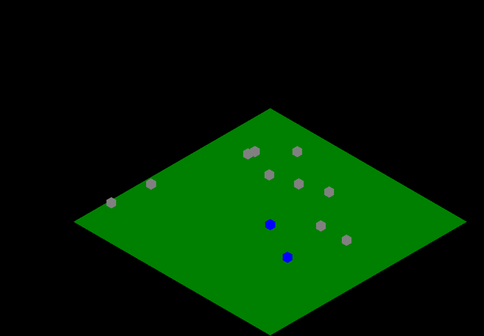

# mmorpg_js_template

my attempt at creating a small footprint foundation for a MMORPG game,
written using only:
- vanilla JS
- and NodeJS with the "websocket" package
- and ThreeJS for the 3d client

### preview

Feel free to contribute, have fun
